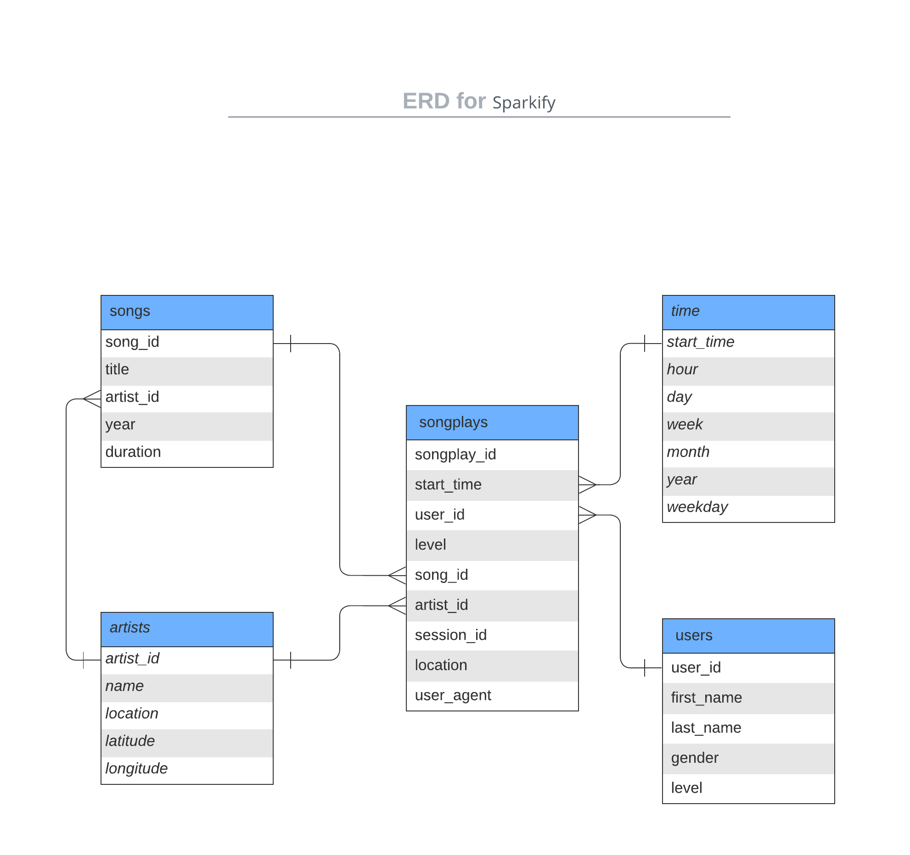

# DATA MODELING WITH POSTGRES
## ROJECT DESCRIPTION
---
**Sparkify** is new music streaming app wants to analyze the data they've been collecting on songs and user activity on their. The analytics team is particularly interested in understanding what songs users are listening to. Currently and other analysis needs. 

using postgresSql through python and sql to create a Postgres database with tables,build an ETL pipeline and data modeling by building fact and dimension tables for a star schema for a particular analytic focus to optimize queries on song play analysis 

## DATASET
---
there are 2 datasets **The first dataset** is a subset of real data from the [Million Song Dataset](http://millionsongdataset.com/). Each file is in JSON format and contains metadata about a song and the artist of that song. The files are partitioned by the first three letters of each song's track ID.

this is sample of data

```
{"num_songs": 1, 
"artist_id":"ARJIE2Y1187B994AB7", "artist_latitude": null, "artist_longitude": null, "artist_location": "",
"artist_name": "Line Renaud", 
"song_id": "SOUPIRU12A6D4FA1E1", 
"title": "Der Kleine Dompfaff", "duration": 152.92036,
"year": 0}
```
---

**The second** dataset consists of log files in JSON format generated by this [event simulator](https://github.com/Interana/eventsim) based on the songs in the dataset above. These simulate activity logs from a music streaming app based on specified configurations.

this is sample of data

```
{'artist': 'Stephen Lynch',
 'auth': 'Logged In',
 'firstName': 'Jayden',
 'gender': 'M',
 'itemInSession': 0,
 'lastName': 'Bell',
 'length': 182.85668999999999,
 'level': 'free',
 'location': 'Dallas-Fort Worth-Arlington, TX',
 'method': 'PUT',
 'page': 'NextSong',
 'registration': 1540991795796.0,
 'sessionId': 829,
 'song': "Jim Henson's Dead",
 'status': 200,
 'ts': 1543537327796,
 'userAgent': 'Mozilla/5.0 (compatible; MSIE 10.0; Windows NT 6.2; WOW64; Trident/6.0)',
 'userId': '91'}
```
## Data base design 
---
this design is represent the star schema design 




### Fact Table
songplays
records in log data associated with song plays i.e. records with page NextSong
>	songplay_id, start_time, user_id, level, song_id, artist_id, session_id, location, user_agent.

### Dimension Tables
**users**

users in the app
>	user_id, first_name, last_name, gender, level

**songs**

songs in music database
>	song_id, title, artist_id, year, duration

**artists**

artists in music database
>	artist_id, name, location, latitude, longitude

**time**

timestamps of records in songplays broken down into specific units
>	start_time, hour, day, week, month, year, weekday

and this desing help analysis team to create sampler quaries because this design more denormalize so don't need a lot of joins to create one quries.

for example this query if the database is normalize it need more than two table  
```sql
select 
  songs.song_id, 
  songs.artist_id
from 
  songs 
  join artists on songs.artist_id = artists.artist_id 
where 
  songs.title =% s
  and artists.name =% s
  and songs.duration =% s;
```
without denormalization 
```sql
select 
    songs.song_id,
    songs.artist_id
from
    songs
    join artists on songs.artist_id =artists.artist_id
    join song_duration on song_duration.songid = songs.songid 
where 
    songs.title=%s 
    and artists.name=%s 
    and song_duration.duration=%s;
```
## Running 
---
1. prepare Environment  install python and postgresSql
2. first run python file ``create_tables.py`` to resat or create data set you can run it from **Termanil** or any **python IDE**
3. run ``etl.py`` using  **Termanil** or any **python IDE** or ``etl.ipynb`` using  **jupyter notebook** 
4. run ``test.ipynb`` to test and see the development in database
5. close any connection opening 
## files
---
### (folder) data/log_data
This folder contains **First data set** a collection of JSON log files. each file is in JSON format and contains metadata about a song and the artist of that song.

### (folder) data/song_data
This folder contains **second data set** a collection of JSON log files. each file is in JSON format and contains simulate activity logs from a music streaming app based on specified configuration of first data set.

### create_tables.py
This Python script use to drops and creates your tables. when run this file the database reset the tables before each change in database design should run this script 

### etl.ipynb
A Python Jupyter Notebook that was used to reads and processes a single file from song_data and log_data and loads the data into the tables , same EDA and detailed instructions on the ETL.

### etl.py
This Python script use to reads and processes files from song_data and log_data and loads them into your tables consider pipleline for ETL.


### sql_queries.py
A Python script that contains all your sql  queries,and is imported into the other files.

### test.ipynb
A Python Jupyter Notebook that was used to displays the first few rows of each table to let you check the database.

## libreries and tools 
---
>1. psycopg2
>2. datetime
>3. os
>4. pandas 


>* juputer notebook 
>* python 
>* postgresSql
>* text editor
